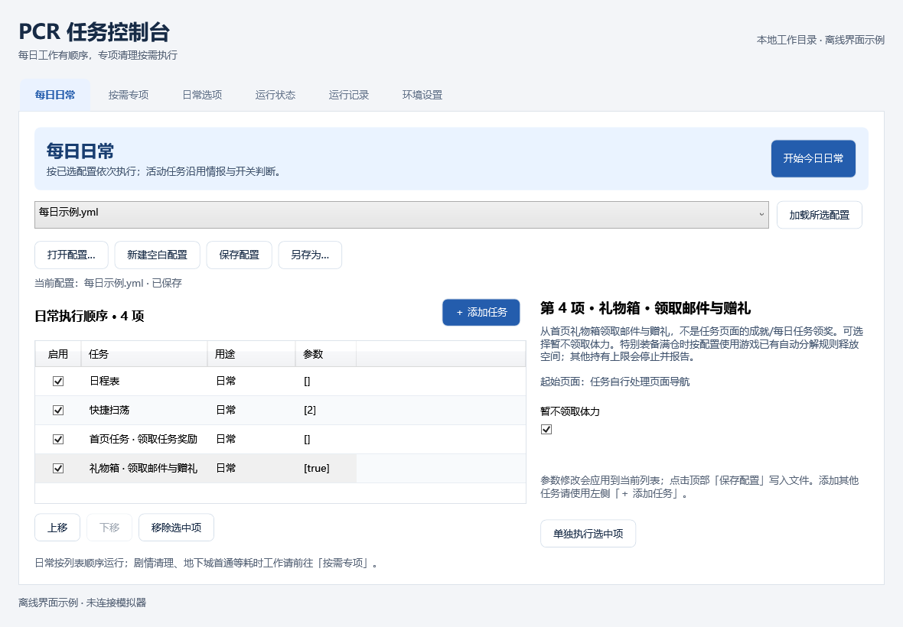

# PCR 日常脚本

帮你自动完成《公主连结》国服的扫荡、领奖、商店购买等日常，也可以单独运行地下城、深域和角色培养任务。

提供两种用法，执行的是同一套任务，按自己的习惯选择：

- [命令行](#命令行)：下载源码、修改配置，在终端运行。
- [图形界面](#图形界面)：下载 Windows 程序，在窗口里选择任务和运行。

## 运行前准备

需要 Windows 电脑，以及雷电模拟器或 Android 手机。图形界面要求 Windows 10（1903 或更新版本）/ Windows 11。

- **雷电模拟器：** 把分辨率设为 **960×540**，启动游戏并登录到首页。
- **手机：** 开启“开发者选项”和“USB 调试”，用数据线连接电脑，在手机上允许调试。目前只在雷电模拟器上测试过，手机上可能出现识别或点击不准的情况。

日程表和竞技场会使用你在游戏里保存的安排和队伍。快捷扫荡默认用预设 2；只有困难关卡掉落加倍时可能改用预设 3，运行前请检查这两个预设的内容。扫荡、调查和商店购买会消耗体力或对应货币，不需要的任务可以从执行列表中去掉。具体说明见 [任务列表](docs/guides/tasks.md)。

## 命令行

先安装 [Python 3.12 x64](https://www.python.org/downloads/windows/) 和 [Git](https://git-scm.com/downloads/win)。安装 Python 时勾选“Add python.exe to PATH”，然后打开 PowerShell：

```powershell
git clone --depth 1 https://github.com/Gibberer/pcr-script.git
cd pcr-script
python -m venv .venv
./.venv/Scripts/python.exe -m pip install -r requirements.txt
Copy-Item runtime_defaults.yml daily_config.yml
notepad daily_config.yml
```

在打开的配置文件里：

- 使用雷电模拟器时，把 `Extra` 下的 `dnpath` 改成模拟器的安装目录，例如 `'D:/leidian/LDPlayer9'`。
- 使用手机时，`dnpath` 留空，`adb_path` 填入 `adb.exe` 的位置；ADB 的安装和多设备设置见 [命令行指南](docs/guides/command-line.md#2-配置设备和任务)。
- `Task` 下是要执行的任务。检查列表，删去不需要的项目，保存文件。

在同一个 PowerShell 窗口中运行：

```powershell
./.venv/Scripts/python.exe -X utf8 daily_task.py --config daily_config.yml
```

以后在项目文件夹里执行这条命令即可。单项任务、自定义配置等用法见 [命令行指南](docs/guides/command-line.md)。

## 图形界面

从 [下载页面](https://github.com/Gibberer/pcr-script/releases) 下载 `PcrDesktop-win-x64.zip`，**解压整个压缩包**，再双击 `PcrDesktop.exe`。

使用中遇到问题，可以查阅 [图形界面使用说明](docs/guides/desktop.md)。



## 单独运行任务

命令行使用 `scripts/daily/task.py` 加任务名，可以单独执行一项任务。例如，只领取礼物：

```powershell
./.venv/Scripts/python.exe -X utf8 scripts/daily/task.py get_gift --config daily_config.yml
```

任务名、参数和注意事项见 [任务列表](docs/guides/tasks.md)。同一台模拟器或手机不要同时运行多份脚本，包括同时从窗口和命令行启动。

## 开发

想修改脚本，可以下载完整仓库，也可以把项目文件夹交给 AI Agent 协助开发。工程说明见 [文档索引](docs/README.md)，打包方法见 [构建与发布](docs/releases.md)。
