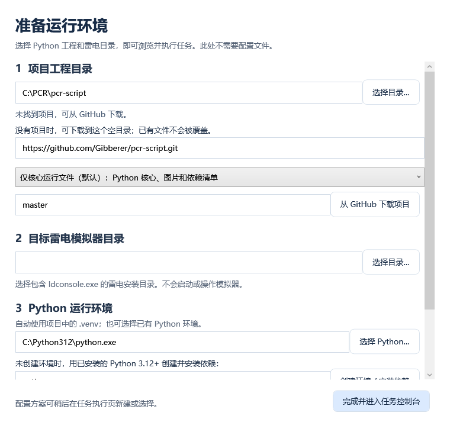
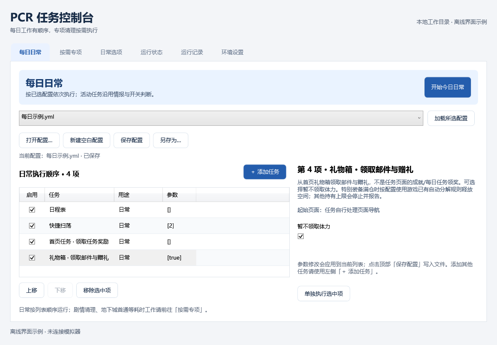
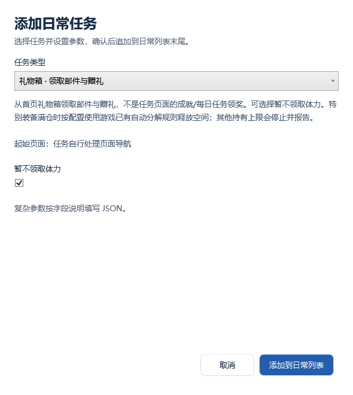
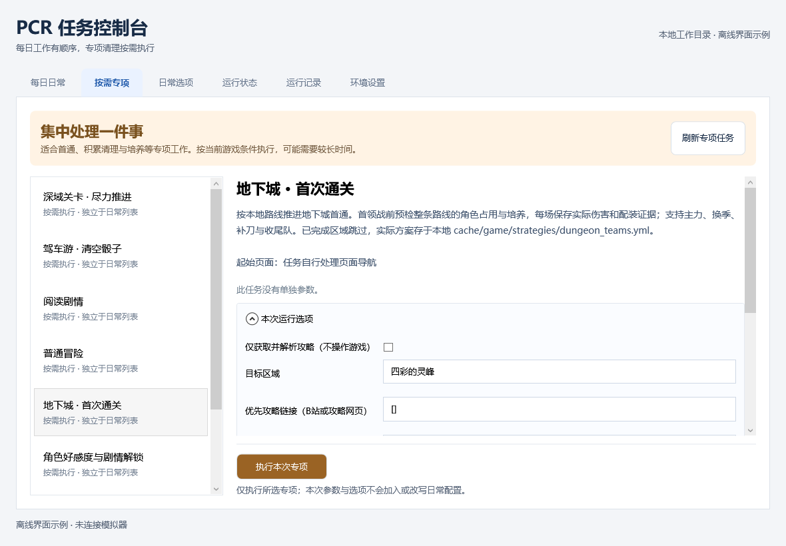
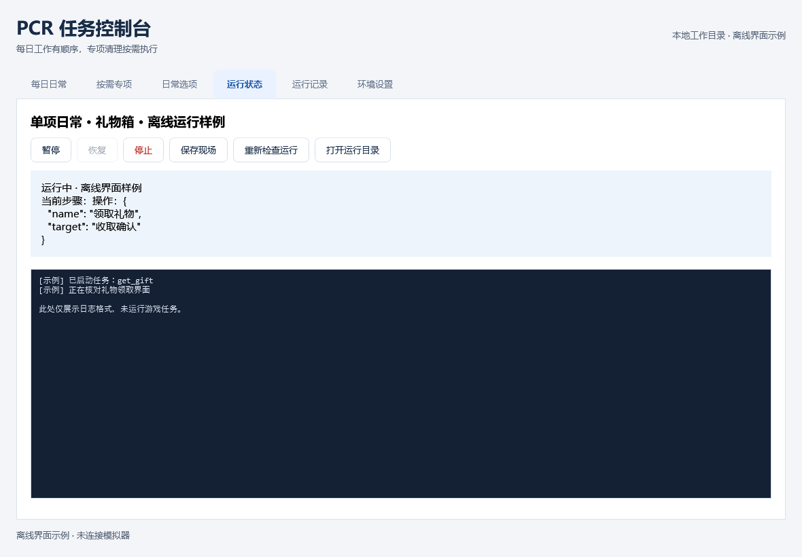

# GUI 使用指南

从 [GitHub Releases](https://github.com/Gibberer/pcr-script/releases) 下载 `PcrDesktop-win-x64.zip`，完整解压后运行 `PcrDesktop.exe`。EXE、DLL 和 `.exe.config` 必须放在一起。无需提前 clone 仓库；源码和运行环境在 GUI 内准备。尚未发布的版本可从 [Windows GUI 的 Actions](https://github.com/Gibberer/pcr-script/actions/workflows/desktop.yml) 下载 Artifact，再解压其中的 ZIP。

界面截图使用离线示例配置，不含真实账号或游戏数据。任务范围另见 [任务使用指南](tasks.md)。

## 1. 首次设置

适用 Windows 10 1903+ / Windows 11，使用系统 .NET Framework 4.8，不需要安装 .NET SDK。打开 GUI 不需要 Python；执行任务需要 Windows x64 Python（推荐 3.12）及雷电或已授权的 ADB 设备，下载/更新源码需要 Git。ADB 模式需安装 Android Platform Tools 并能运行 `adb devices`。

1. 选择工程目录。可以使用已有工程，也可以选择空目录或新目录，由 GUI 下载源码；非空的无关目录不会被覆盖。
2. 下载范围默认“仅核心运行文件”，包含 Python 执行代码、游戏图片、依赖清单和 GUI 默认选项文件。完整仓库适合需要额外脚本或开发的人。源码下载默认使用 `master` 分支；旧版保存的默认开发分支会自动改为 `master`，用户明确设置的其他分支保留。
3. 使用雷电后台驱动时选择包含 `ldconsole.exe` 的安装目录。使用 ADB 时留空雷电目录，填写 `adb`（已加入 PATH）或选择 Android Platform Tools 的 `adb.exe`；GUI 会检查该程序可运行。连接多个 ADB 设备时，填写 `adb devices` 显示的目标序列号；只有一个已授权设备时可留空。
4. 自动检测已有 Python，或使用引导里的官网下载入口安装 Python 3.12 x64 后重新检测。点击“创建环境 / 安装依赖”，GUI 在工程中创建 `.venv` 并安装依赖，首次需要联网。
5. 检查通过后进入控制台。以后可在“环境设置”重新配置；无须在首次引导选择 YAML。

同一设备同时只能由一个自动化进程操作。雷电目录非空时始终使用后台驱动，失败时不会自动切换至 ADB；目录留空才使用 ADB。界面识别使用 960×540 设计坐标，操作按实际截图宽高分别换算；当前任务流程只在雷电 960×540 实机验证，其他 Android 设备、分辨率和非 16:9 布局仍需实测。

## 2. 配置每日日常

程序优先加载上次有效配置，其次是工程中的 `daily_config.yml`；都不存在时显示空白配置。顶部可以打开 YAML、新建、保存或另存为，配置下拉框显示文件名，悬停可查看完整路径。

- **添加**：点击列表上方“＋ 添加任务”，在独立窗口选择类型、填写参数，再点击添加。取消不会改动列表。
- **编辑**：点击已有任务，在右侧修改该项参数。有效值会立即应用到当前列表；修改任务类型应移除后重新添加。无效参数显示原因，修正后才能切换行或执行。
- **顺序与启用**：勾选决定是否执行，上移/下移调整顺序，移除删除当前项。相同任务可以出现多次。
- **保存**：顶部显示未保存状态。保存写入 YAML，另存为保留源文件并创建独立副本；切换配置或退出时会提醒未保存修改。
- **运行**：“开始今日日常”先保存，再运行所有启用项；“单独执行此日常项”只运行选中项。较小窗口将开始按钮放在配置工具栏。

任务参数支持开关、数字、文本及 JSON。每日可选任务和消费范围见 [日常任务列表](tasks.md#一日常任务)；新建配置不会自动加入消费或角色培养任务。

“日常选项”按活动/功能折叠分组，与日常配置一起保存。设备连接可在环境设置中填写，ADB 路径和序列号也可在运行选项中按配置调整。旧配置里已有的专项任务仍保留并标注，不会自动删除；新增日常项只展示日常类别。

## 3. 执行按需专项

在“按需专项”左侧选择任务，右侧阅读说明和起始页面要求，填写参数及本次选项，然后点击“执行本次专项”。地下城、深域、角色强化、角色好感度、驾车游等入口放在这里。

专项不要求保存 YAML，本次编辑不改写日常列表。初值来自当前配置及程序默认值，**切换专项会重新初始化表单**。消费、培养、试打等选项应按本次目标明确设置，不能把默认关闭当作已授权执行。

“仅获取并解析攻略”和“只核验、不开战”是供诊断使用的配置字段，不在 GUI 常规选项中显示。当前视频布局、培养与辅助条件识别存在明确边界，未知条件保留待办，不保证任意视频都能生成可执行方案。详见 [任务指南](tasks.md#地下城与深域的来源处理) 和 [视频解析交接](video-strategies.md)。

## 4. 查看运行与历史

“运行状态”显示当前范围、任务、步骤、心跳、耗时和日志。控制按钮随状态启用：运行时可请求暂停，确认暂停后才能继续；停止也需要等待确认。阻塞的系统或网络请求可能延迟响应，不能把请求已发出视为已经停止。停止脚本不会暂停游戏中的战斗。

“保存现场”记录已有观察与线程栈。日志框有长度上限，完整日志及任务结果位于 `cache/daily/runs/<UUID>/`。“运行记录”可刷新最近 100 次记录、查看详情并打开对应目录；空列表会显示提示。

运行结果为 `partial` / `blocked` 时，查看未完成原因与证据，不以 Python 正常退出代替全部通关。心跳失联也不代表已经停止，排查见 [运行诊断](run-diagnostics.md)。确认当前进程结束或进入 `paused` 后，才可用其他工具操作同一模拟器。

GUI 正常关闭前要求本窗口操作及运行结束；意外退出不会自动杀死 Python。重新加载同一工程可以查看 GUI 启动的未结束运行；旧命令入口的历史也可浏览。每个 Windows 会话只打开一个 GUI，但不能据此从不同工程副本同时操作同一模拟器。

## 5. 更新与数据保留

“环境设置”集中管理工程、Python、设备连接和源码版本。源码下载/更新选项默认折叠；更新前检查运行锁、工作区修改和分支，只允许快进，不覆盖本地源码。直接编辑仓库跟踪的 `runtime_defaults.yml` 也会使工作区产生修改，想继续自动更新时可另存配置到 `cache/desktop/profiles/`。更新完成后重新安装依赖并加载配置。

核心下载使用 Git 的局部检出与按需对象下载，保留隐藏 `.git` 供后续更新。修改下载范围只影响新目录，现有工程保持原范围。源码更新不会自动替换 GUI EXE，GUI 升级请下载新的 Release 包。

- GUI 偏好：`%LOCALAPPDATA%/PcrDesktop/settings.json`。
- 默认另存为位置：工程中的 `cache/desktop/profiles/`。
- 账号配置、头像、游戏数据库、作业、视频和运行证据均保存在本地，不包含在 GUI 发布包中。
- GUI 编辑第一个任务组，保留账号字段和其他组，但不提供账号登录或多组切换。账号密码不发送到 GUI 配置接口。
- YAML 保存会重新排版并移除注释，保留 `.bak`；未知字段保留。外部文件已改动时拒绝覆盖，需重新加载再编辑。
- 禁用项存在 `Desktop.plan`，实际 `Task` 仅包含启用项；外部修改 `Task` 时优先采用外部内容。

当前不提供源码/依赖的自动回滚或版本隔离。网络失败可按提示重试，缺少 Python/Git 则先安装；新工程下载失败保留现场，不自动覆盖目录。

## 开发与验收

GUI 为 C# / WPF，Python 任务实现仍在 `pcrscript/tasks/`，由 `pcrscript/desktop.py` 的版本化 JSON 接口执行，不依赖 Agent 入口。构建需要 .NET 10 SDK，最终运行使用系统 Framework 4.8。

本地构建、测试和合并后发布步骤见 [GUI 构建与发布](releases.md)。离屏验证覆盖全部页面、添加/编辑任务、配置保存重载、进程通信、两种源码下载和更新范围；本地还实际启动 WPF 窗口检查日常列表、添加对话框、专项和首次引导。不启动模拟器；游戏与干净 Windows 安装验收仍须按 [待验证记录](game-knowledge/pending-validation.md) 进行。

历史构建及开发接续见 [desktop-handoff.md](desktop-handoff.md)，当前文档以用户使用流程为准。
