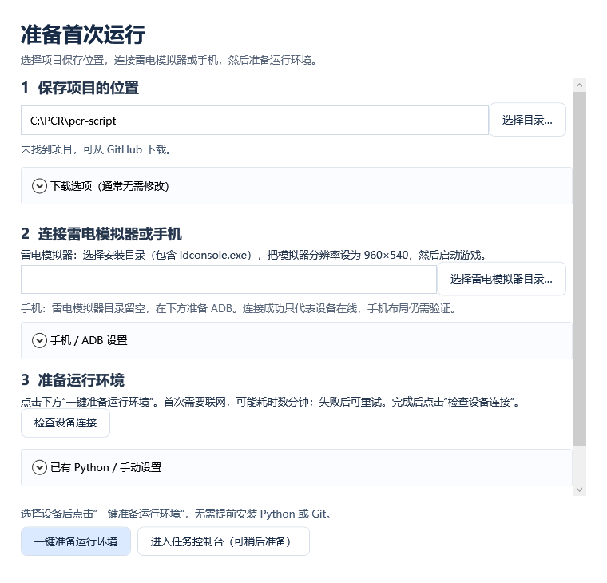
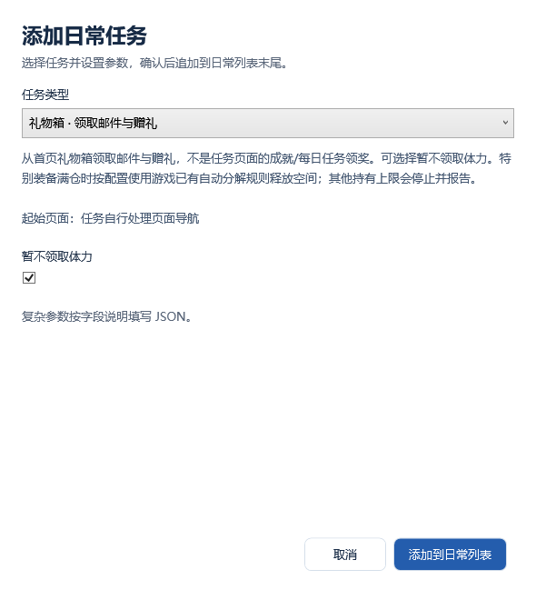
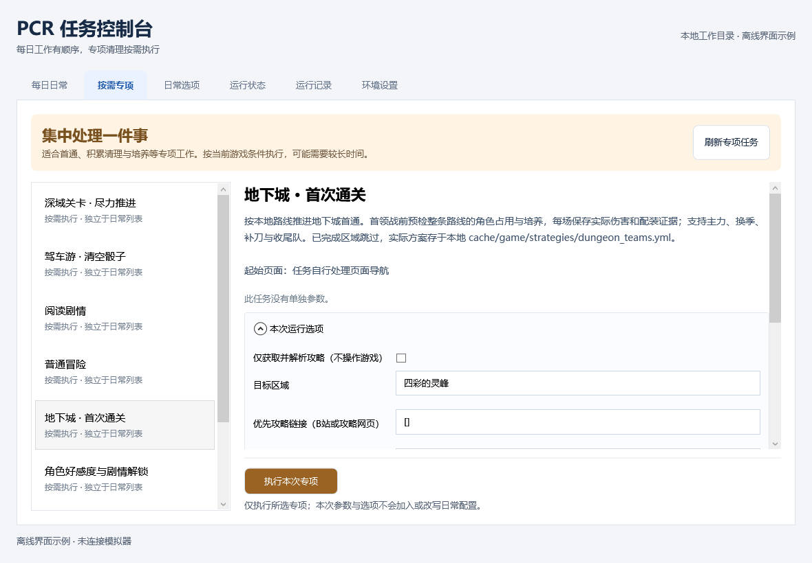
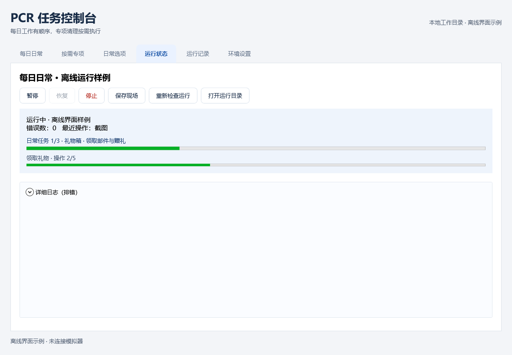
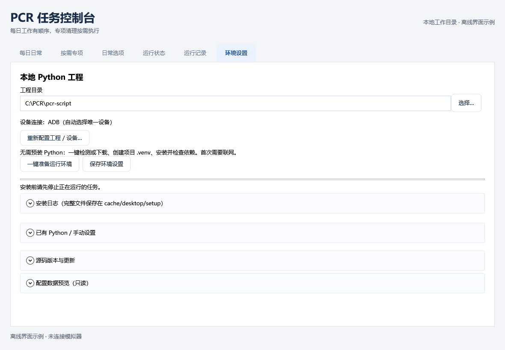

# GUI 使用指南

从 [GitHub Releases](https://github.com/Gibberer/pcr-script/releases) 下载 `PcrDesktop-win-x64.zip`，完整解压后运行 `PcrDesktop.exe`。EXE、DLL 和 `.exe.config` 必须放在一起。无需提前 clone 仓库；源码和运行环境在 GUI 内准备。尚未发布的版本可从 [Windows GUI 的 Actions](https://github.com/Gibberer/pcr-script/actions/workflows/desktop.yml) 下载 Artifact，再解压其中的 ZIP。

界面截图使用离线示例配置，不含真实账号或游戏数据。任务范围另见 [任务使用指南](tasks.md)。

## 1. 首次设置

适用 Windows 10 1903+ / Windows 11，使用系统 .NET Framework 4.8，不需要安装 .NET SDK。GUI 会按需下载 Git 和 Python，创建工程专用 `.venv` 并安装依赖；手机模式也可在 GUI 下载 ADB。用户需要准备网络、模拟器或手机、游戏登录和游戏内预设。无需提前安装开发工具、修改 PATH、打开终端或新建 YAML。

本页对应当前源码。旧版 GUI 没有“一键准备运行环境”时，需要更换包含此功能的新构建包；仅更新 Python 源码不会更新 EXE。Actions 的 Artifact 需要登录 GitHub，并选择对应提交的成功构建；尚未构建或发布的功能不会出现在旧包里。

1. 保留默认项目位置，或选择空目录、新目录、已有工程。程序不会覆盖非空的无关目录。建议使用磁盘空间充足、路径较短、当前用户可写的目录。
2. 按下方“设备准备”的说明，选择雷电模拟器的安装目录，或连接手机。源码下载选项通常无需修改：默认 `master` 分支、“仅核心运行文件”。需要命令行或交给 Agent 开发时，在下载选项里选择“完整仓库”。
3. 点击 **“一键准备运行环境”**。程序依次下载项目（已有工程跳过）、检测或下载 Python、创建 `.venv`、安装根目录 `requirements.txt`、检查依赖关系和关键模块导入。等待“运行环境已就绪”；完整 pip 输出在“准备过程与错误详情”，安装日志保存在工程 `cache/desktop/setup/`。
4. 点击 **“检查设备连接”**，按提示解决未授权、离线、多设备等问题。此检查只读取连接列表，不点击游戏、不截图、不启动任务；有任务正在运行时会拒绝检查。
5. 登录游戏首页，再进入控制台，核对默认日常的任务与选项。已保存的日程安排、竞技场队伍和扫荡预设需用户在游戏内准备；缺少这些设置的任务先取消勾选。完成后按第 2 节运行。

想先看控制台时，可在项目下载完成后直接进入；缺少环境会定位到“环境设置”，在那里点击同名准备按钮继续。已有可用 Python 环境可在“已有 Python / 手动设置”中选择。自动安装始终使用工程 `.venv`，不会向所选的系统 Python 安装项目依赖。已有依赖的版本不同不会仅因版本差异被拒绝运行；主动安装会按 `requirements.txt` 更新并检查。

### 设备准备

| 设备 | 要做的操作 | 连接检查通过后 |
|---|---|---|
| 雷电模拟器 | 选择包含 `ldconsole.exe` 的安装目录，启动模拟器，设置 960×540；无需另下 ADB | 登录游戏首页，核对日程、竞技场队伍和扫荡预设 |
| Android 手机 | 雷电模拟器目录留空。展开“手机 / ADB 设置”，选择已有 `adb.exe`，或打开官方许可页面、阅读同意后勾选并点击“下载 ADB 工具”。开启开发者选项、USB 调试，使用支持数据传输的数据线连接，解锁手机并允许此电脑调试 | 只有一个已授权设备时序列号可留空；多个设备时从下拉框选择，再检查一次。手机布局尚未完成实机验收 |

ADB 路径填写 `adb` 表示使用系统 PATH；使用 GUI 下载按钮会自动填入完整路径。GUI 不会安装手机厂商的 USB 驱动，也不能代替用户在手机上批准调试授权。

同一设备同时只能由一个自动化进程操作。雷电模拟器目录非空时使用雷电模拟器驱动；窗口输入失败时驱动会尝试 ADB 回退。黑屏截图复核和失败滚动条的专用回退须通过 `Extra.adb_serial` 明确指定对应雷电实例的连接，并核对在线状态与画面尺寸；只有一台模拟器和一个 ADB 设备、或尺寸相同，都不能证明二者是同一设备。未明确配置时，黑屏保留原图等待，专用滚动回退报告无法关联。默认使用雷电目录中已有的 `adb.exe`，显式配置的 ADB 路径仍优先。目录留空时直接使用 ADB。界面识别使用 960×540 设计坐标，操作按实际截图宽高分别换算；后台窗口点击和滑动使用实际像素尺寸，适配 Windows 显示缩放。当前任务流程只在雷电模拟器 960×540 实机验证，其他 Android 设备、分辨率和非 16:9 布局仍需实测。

雷电模拟器窗口句柄不可用、但模拟器仍通过 ADB 连接时，可在配置的 `Extra` 中留空 `dnpath`、指定 `adb_serial`，并设置 `adb_unicode_console_path` 为本机 `ldconsole.exe` 的绝对路径、`adb_unicode_console_index` 为实例序号。此时截图和点击走 ADB，中文角色名通过雷电模拟器控制台输入；程序仍会回读搜索词并核验角色。未配置控制台时，ADB 遇到中文编队会逐页扫描并核验角色头像。此组合只在雷电模拟器 960×540 验证，其他设备需单独验证。

## 2. 运行与调整每日日常

准备好运行环境和设备后，进入“每日日常”，核对任务与消费选项，再点击“开始今日日常”。新工程会加载根目录 `runtime_defaults.yml` 中已经排好的日常任务，首次保存时生成忽略的 `daily_config.yml`，不修改共用默认文件。快捷扫荡默认使用游戏预设 2，仅困难掉落活动时可能切到预设 3；首次使用前核对游戏内预设。不想执行的任务可取消勾选。

程序优先加载上次有效配置，其次是工程中的 `daily_config.yml`，最后才使用 `runtime_defaults.yml`。已有配置不会被默认列表覆盖。需要自定义时，可以编辑列表，或用顶部按钮打开、新建、保存及另存 YAML；悬停配置名可查看完整路径。

- **运行**：“开始今日日常”先保存，再运行所有启用项；“单独执行此日常项”只运行选中项。较小窗口将开始按钮放在配置工具栏。
- **编辑**：点击已有任务，在右侧修改该项参数。有效值会立即应用到当前列表；修改任务类型应移除后重新添加。无效参数显示原因，修正后才能切换行或执行。
- **添加**：想扩充默认列表时，点击“＋ 添加任务”，在独立窗口选择类型和参数。取消不会改动列表。
- **顺序与启用**：勾选决定是否执行，上移/下移调整顺序，移除删除当前项。相同任务可以出现多次。
- **保存**：顶部显示未保存状态。保存写入 YAML，另存为保留源文件并创建独立副本；切换配置或退出时会提醒未保存修改。

任务参数支持开关、数字、文本及 JSON。每日可选任务和消费范围见 [日常任务列表](tasks.md#一日常任务)。“新建配置”用于从空白列表自行编排；默认配置不会加入地下城、深域或角色培养专项。

“日常选项”按活动/功能折叠分组，与日常配置一起保存。设备连接可在环境设置中填写，ADB 路径和序列号也可在运行选项中按配置调整。旧配置里已有的专项任务仍保留并标注，不会自动删除；新增日常项只展示日常类别。

## 3. 执行按需专项

在“按需专项”左侧选择任务，右侧阅读说明和起始页面要求，填写参数及本次选项，然后点击“执行本次专项”。地下城、深域、角色强化、角色好感度、驾车游等入口放在这里。

专项不要求保存 YAML，本次编辑不改写日常列表。初值来自当前配置及程序默认值，**切换专项会重新初始化表单**。消费、培养、试打等选项应按本次目标明确设置，不能把默认关闭当作已授权执行。

“仅获取并解析攻略”和“只核验、不开战”是供诊断使用的配置字段，不在 GUI 常规选项中显示。当前视频布局、培养与辅助条件识别存在明确边界，未知条件保留待办，不保证任意视频都能生成可执行方案。详见 [任务指南](tasks.md#地下城与深域的来源处理) 和 [视频解析交接](../video-strategies.md)。

## 4. 查看运行与历史

“运行状态”从运行记录读取日常列表或单项任务进度，以及当前任务的 OCR 处理阶段或旧图片动作进度。有明确批次上限时显示计数，无法预知总数时显示当前阶段与活动中的进度条；进度不代表游戏目标已经完成。界面还显示当前状态和耗时。终端输出收在默认折叠的“详细日志（排错）”中；命令行的动态进度条不会写入 GUI 日志。控制按钮随状态启用：运行时可请求暂停，确认暂停后才能继续；停止也需要等待确认。阻塞的系统或网络请求可能延迟响应，不能把请求已发出视为已经停止。停止脚本不会暂停游戏中的战斗。

“保存现场”记录最近一次已有观察与线程栈，确认后界面显示生成的 `incident-...` 目录；它不会额外操作游戏或保证取得按钮点击时的新截图。日志框有长度上限，完整日志及任务结果位于 `cache/daily/runs/<UUID>/`。“运行记录”可刷新最近 100 次记录、查看详情并打开对应目录；空列表会显示提示。运行状态会自动刷新，无需手动重新检查。

运行结果为 `partial` / `blocked` 时，查看未完成原因与证据，不以 Python 正常退出代替全部通关。心跳失联也不代表已经停止，排查见 [运行诊断](../run-diagnostics.md)。确认当前进程结束或进入 `paused` 后，才可用其他工具操作同一模拟器。

GUI 正常关闭前要求本窗口操作及运行结束；意外退出不会自动杀死 Python。重新加载同一工程可以查看 GUI 启动的未结束运行；旧命令入口的历史也可浏览。每个 Windows 会话只打开一个 GUI，但不能据此从不同工程副本同时操作同一模拟器。

## 5. 更新与数据保留

“环境设置”集中管理工程、Python、设备连接和源码版本。源码下载/更新选项默认折叠；更新前检查运行锁、工作区修改和分支，只允许快进，不覆盖本地源码。GUI 首次保存共用默认设置时会生成 `daily_config.yml`；自定义配置也可另存到 `cache/desktop/profiles/`。更新完成后重新安装依赖并加载配置。

核心下载使用 Git 的局部检出与按需对象下载，保留隐藏 `.git` 供后续更新。修改下载范围只影响新目录，现有工程保持原范围。源码更新不会自动替换 GUI EXE，GUI 升级请下载新的 Release 包。

- GUI 偏好：`%LOCALAPPDATA%/PcrDesktop/settings.json`。
- 默认项目目录：`%LOCALAPPDATA%/PcrDesktop/workspace/`；也可自行选择。
- 自动下载工具：`%LOCALAPPDATA%/PcrDesktop/tools/`，按版本存放，通过 SHA-256 校验后解压；不修改系统 PATH。便携 Python 是 `.venv` 的基础解释器，仍在使用时不要删除工具目录。
- Python 依赖：工程中的 `.venv/`；安装日志：`cache/desktop/setup/`。
- 默认另存为位置：工程中的 `cache/desktop/profiles/`。
- 账号配置、头像、游戏数据库、作业、视频和运行证据均保存在本地，不包含在 GUI 发布包中。
- GUI 编辑第一个任务组，保留账号字段和其他组，但不提供账号登录或多组切换。账号密码不发送到 GUI 配置接口。
- YAML 保存会重新排版并移除注释，保留 `.bak`；未知字段保留。外部文件已改动时拒绝覆盖，需重新加载再编辑。
- `Task` 是 YAML 中唯一的执行列表；GUI 禁用项及其位置保存在 `%LOCALAPPDATA%/PcrDesktop/plans/`，不写入项目配置。外部修改 `Task` 后，以外部内容为准。

当前不提供源码/依赖的自动回滚。新工具和源码在临时目录下载完成后才移入目标目录；中断或网络失败可重试。依赖安装失败会保留 `.venv`，重试时继续安装并检查，不删除用户数据。强制关机留下的临时目录不用于判断安装成功。

## 6. 首次使用常见问题

| 现象 | 处理方式 |
|---|---|
| 界面能打开，但任务列表没有加载 | 到“环境设置”点击“一键准备运行环境”；成功后自动加载配置。若报源码接口缺失，更新源码或下载到新空目录 |
| Python / Git / ADB 下载失败或校验失败 | 查看错误详情，确认能访问 GitHub、NuGet 或 Google 下载站；检查网络、代理和磁盘空间后重试。校验失败不会执行下载文件；持续失败时更新 GUI 或选择手动安装的工具，不关闭校验 |
| pip 报错 / 缺依赖 / DLL 加载失败 | 查看提示中的 `cache/desktop/setup/*.log`；修复网络后再次准备。手动创建的环境建议使用 Python 3.12 x64；不要向系统 Python 反复安装。缺系统组件时按错误提示安装官方组件 |
| 已有 `.venv` 损坏或使用了错误版本 Python | 停止任务、关闭其他使用该环境的程序，把工程 `.venv` 文件夹改名备份；重新打开 GUI，在“已有 Python / 手动设置”选择合适基础 Python 后一键准备。不要移动正在使用的环境 |
| 手机显示未授权 / 离线 / 查无设备 | 解锁手机并允许 USB 调试；重新插拔数据线，确认不是仅充电线。仍无设备时检查手机厂商 USB 驱动和开发者选项 |
| 发现多个设备 | 从序列号下拉框选择目标，重新检查；无需去命令行查序列号 |
| 提示任务仍在运行 | 等待原任务结束；不要再启动另一份自动化。暂停、停止与失联排查见[运行诊断](../run-diagnostics.md) |
| 连接成功但识别失败 | 核对雷电模拟器 960×540、游戏已登录且在首页。其他设备布局仍需适配，查看运行记录，不要反复盲目重跑 |
| 想使用终端，但找不到 `daily_task.py` | 当前是核心下载；下载“完整仓库”到新目录，然后按[命令行指南](command-line.md)运行 |
