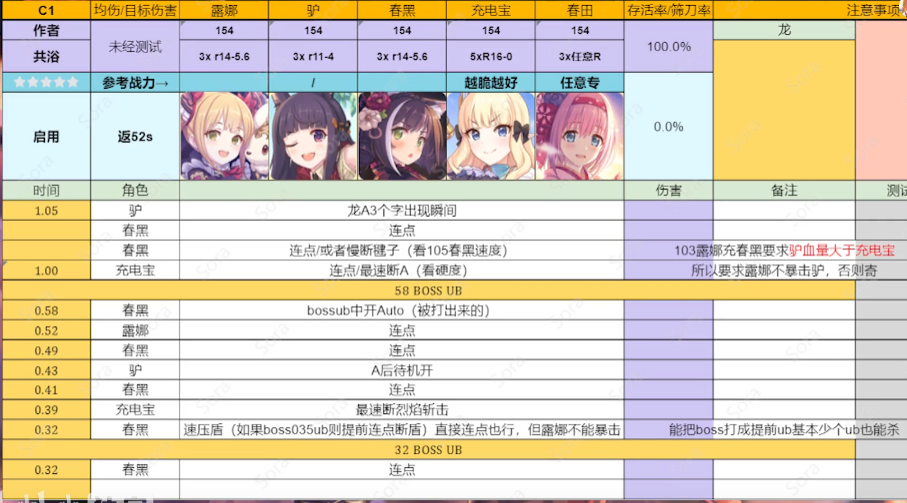

## 公会战轴提取器
> 未经过测试，可用性待确认

输入对应轴图片，转换为符合autobattle的轴数据

输入图片：


输出:
```yaml
job_list:
    "Test Output":
        - 65 3 # 龙A3个字出现瞬间   
        - 65 2 # 连点   
        - 65 2 # 连点或者慢断键子（看105春黑速度    103露娜充春黑要求驴血量大于充电宝   
        - 60 1 # 连点/最速断A（看硬度    所以要求露娜不暴击驴，否则奇   
        # 58BOSSUE   
        - 58 2 # bossub中开Auto（被打出来的   
        - 52 5 # 连点   
        - 49 2 # 连点   
        - 43 3 # A后待机开   
        - 41 2 # 连点   
        - 39 1 # 最速断烈焰斩击   
        - 32 2 # 速压盾（如果boss035ub则提前连点断盾）直接连点也行，但露娜不能暴击    能把boss打成提前ub基本少个ub也能杀   
        # 32BOSS UE   
        - 32 2 # 连点   
```

## 环境依赖

* python3.7以上
* paddleocr、paddlepaddle

## 使用方法

1. 将轴图片重名为test.png 替换掉当前目录的test.png文件
2. 执行battleline_extractor.py
3. 在当前目录查看输出文件output.yaml

## 使用限制

* paddleocr需要使用服务端的模型进行识别，默认启动会自动下载mobile的模型。可以在默认下载结束后把对应目录下的模型修改为服务端模型
* 目前仅解析了示例的样式，其他未进行测试
* 别名与正式名字的映射在[/data/alias.json](data/alias.json)下，目前不全有未记录的需要补充

## 下一步

- [ ] ocr修改为使用百度图像识别接口进行识别
- [ ] 适配主要出轴的几个up的轴图
- [ ] 支持传入视频及时间直接转换
- [ ] 一个Gui界面辅助
